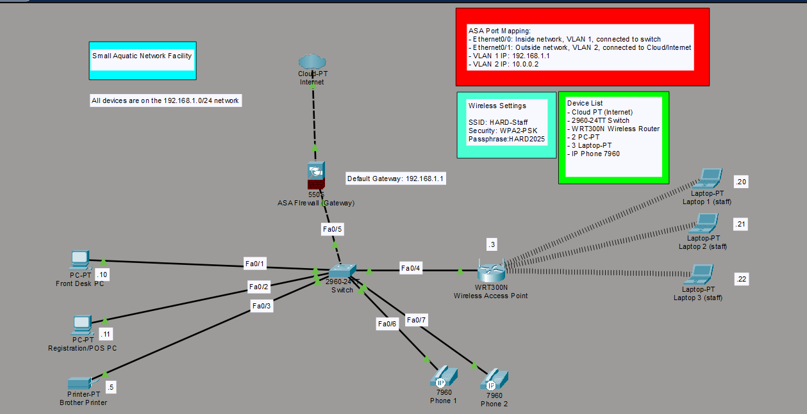
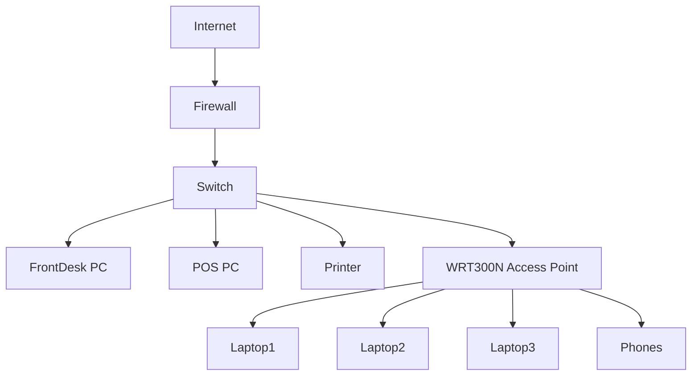

# Aquatic Facility Network Simulation (Cisco Packet Tracer)

## Overview

This project simulates a small-business IT network based on my aquatic facility where I worked. The goal was to model how common workplace devices (front desk systems, staff laptops, printers, and wireless clients) connect within a network and to practice troubleshooting typical IT support issues.

The network was built in Cisco Packet Tracer and includes both wired and wireless infrastructure, along with a firewall that represents security boundaries between internal systems and the internet.

---

## Objectives

* Design a realistic small-scale business network
* Configure core networking components (firewall, switch, wireless access point)
* Simulate device connectivity across wired and wireless environments
* Practice troubleshooting common IT support issues

---

## Network Topology

The network follows this structure:

### Devices Included:

* 2 Desktop PCs (Front Desk / POS System)
* 3 Staff Laptops (Wireless)
* 1 Network Printer
* 1 Tablet (simulate a wireless display/TV system)
* Wireless Access Point (WRT300N)
* Switch (2960-24TT)
* Firewall (ASA 5505)
* Cloud-PT (Internet simulation)

---

## Network Configuration

### IP Addressing Scheme

| Device                   | IP Address      |
| ------------------------ | --------------- |
| Firewall (Gateway)       | 192.168.1.1     |
| Wireless Access Point    | 192.168.1.3     |
| Desktop PCs              | 192.168.1.10–11 |
| Laptops (DHCP or static) | 192.168.1.20–22 |
| Printer                  | 192.168.1.50    |
| Tablet (Display)         | 192.168.1.60    |

---

### Firewall Configuration

The ASA 5505 firewall is configured with:

* **Inside interface (VLAN 1)** → 192.168.1.1
* **Outside interface (VLAN 2)** → Simulated internet connection
* Default route to external network

This allows internal devices to communicate with external systems while maintaining a logical separation between trusted and untrusted networks.

---

### Wireless Configuration

* SSID: `HARD-Staff`
* Security: WPA2-PSK
* Wireless devices include laptops and a tablet

---

### Troubleshooting Issues
- Fixed incorrect default gateway configurations on client devices'
- Resolved VLAN misconfiguration on the ASA interface
- Diagnosed wireless connectivity issues caused by incorrect port usage
- Ensure IP phones have power and proper network connectivity.
---
### Checks
- Checked all wired devices can ping the gateway (192.168.1.1)
- Wireless devices successfully connected and receive IP via DHCP
- All devices communicate within the network.

